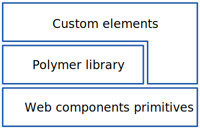

The {{site.project_title}} library is designed to make it easier and faster
for developers to create great, reusable components for the modern web.

## Custom elements extend the web

HTML provides a set of built-in elements like `<button>`, `<form>` and
`<table>`. Each element has its own API of attributes, properties, methods, and
events. Each element has built-in styling, as well as style properties you can
override using CSS.

Anyone can use these elements to build a simple web page. But they're 
limited. To build something as simple as a set of tabs, you need HTML 
plus CSS and usually script, too.

With custom elements, you can extend the vocabulary of HTML with your own elements. 
Elements that provide sophisticated UI. Elements that are as easy to use as `<select>`: 

    <my-tabstrip>
      <my-tab>
        Home
      </my-tab>
      <my-tab>
        Services
      </my-tab>
      <my-tab>
        Contact Us
      </my-tab>
    <my-tabstrip>

## Is {{site.project_title}} web components? Is it elements?

{{site.project_title}} isn't either of those things. {{site.project_title}} is built on top of the web components standards and it helps you build your own custom elements:

*   **Web components**. These standards provide the primitives you 
    need to build new components. You can build your own custom elements
    using these primitives, but it can be a lot of work.

    Not all browsers support these standards yet, so the [web components polyfill 
    library](http://webcomponents.org/polyfills/) fills the gaps, implementing the APIs in JavaScript.

*   **The {{site.project_title}} library**. Provides a declarative syntax that 
    makes it simpler to define custom elements. And it adds features like 
    templating, two-way data binding and property observation to help 
    you build powerful, reusable elements with less code.

*   **Custom elements**. If you don't want to write your own elements, there 
    are a number of elements _built with_ {{site.project_title}} that you can drop 
    straight into your existing pages. These elements depend on the {{site.project_title}} 
    library, but you can use the elements without using {{site.project_title}} directly.

    You can mix and match elements built with {{site.project_title}} with other
    custom elements, as well as built-in elements.

## Get some elements

The {{site.project_title}} team has written collections of elements that you can use 
in your apps. You can find them on the [Element catalog](https://elements.polymer-project.org/).

## Write your own

Interested in using the {{site.project_title}} library to build your own elements?

Take a quick tour of the features:

<a href="../start/quick-tour.html">
  <paper-button raised><core-icon icon="arrow-forward"></core-icon>Quick tour</paper-button>
</a>

Or jump straight to:

<a href="../devguide/feature-overview.html">
  <paper-button raised><core-icon icon="arrow-forward"></core-icon>Developer guide</paper-button>
</a>

